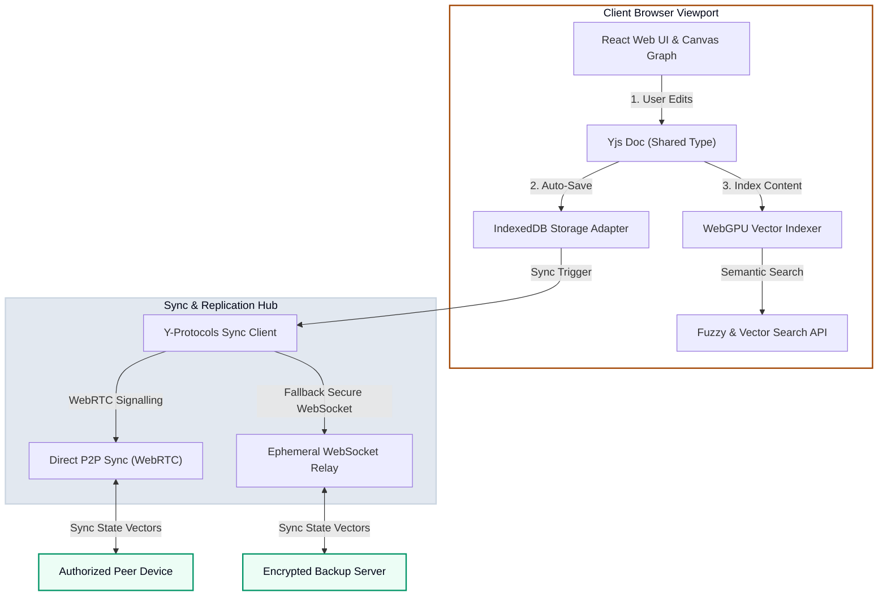

# 📓 Engineering a Local-First Personal Knowledge Base

Where do your thoughts go when you write them down?

Modern Personal Knowledge Management (PKM) tools are at a crossroads. They either lock your thoughts in proprietary cloud silos or force you to manage fragile manual file sync setups. To bridge this gap, I am designing a local-first, decentralized knowledge base that runs entirely in your browser while offering seamless, multi-device sync, local vector search, and visual graph networking.

---

## 🏛️ Local-First & Decentralized Topology

This application is built around a **local-first philosophy**: the local database is the source of truth, and network sync is an optional, opportunistic background task. 

Here is the architectural topology of the local client and sync hub:

---

## ⚡ Technical Pillars

To make the application fast, resilient, and fully private, the implementation focuses on four core technical pillars:

### 1. Conflict-Free Replicated Data Types (Yjs CRDTs)
Instead of dealing with traditional database lockups or merge conflicts when editing notes across devices, the system represents all documents as CRDTs using the `yjs` framework.
* **Concurrent Editing**: Changes made offline on a mobile phone are automatically merged with desktop updates when connection is re-established.
* **Granular History**: Changes are resolved using logical clocks, keeping history footprint small and lightweight.

### 2. Embedded Semantic Search (WebAssembly & WebGPU)
Most search features in modern note-taking apps either rely on plain keyword matching or require sending your private logs to a cloud AI endpoint. This project embeds a fully functional vector search pipeline locally:
* **Transformers in Browser**: Utilizes Xenova's `@xenova/transformers` library to run sentence embedding models (like `all-MiniLM-L6-v2`) inside a Web Worker.
* **Hardware Acceleration**: Accelerates mathematical similarity checks using WebGPU, enabling real-time semantic discovery of related notes as you type.

### 3. High-Performance IndexedDB Storage
To ensure instant load times, the client caches all note nodes and transaction logs locally inside the browser's IndexedDB engine:
* **IndexedDB Adapter**: Stores binary state vectors of the Yjs document to allow rapid incremental loads.
* **Query Caching**: Resolves graph traversal queries locally in memory using a lightweight in-memory graph index, bypassing slow disk-bound loops.

### 4. Interactive 3D Graph visualization
Leveraging lessons from building **The Book Shelf** 3D engine, this project will feature an interactive force-directed graph to visualize your notes.
* **WebGL Layout**: Renders thousands of notes as connected visual nodes in 3D using Three.js.
* **Contextual Clusters**: Uses semantic distance from the vector indexer to dynamically position related notes closer together, even if they aren't explicitly linked.

---

## 🛠️ Target Tech Stack

* **Frontend Framework**: TypeScript, React, TailwindCSS
* **State & Sync**: Yjs, Y-IndexedDB, Y-WebRTC
* **Semantic Engine**: Transformers.js, ONNX Runtime Web
* **Visual Representation**: Three.js, React Three Fiber
* **Hosting / Build**: Vite, Firebase Hosting

---

## 🚀 Status

This project is actively in the design and prototyping phase. Check back soon for the initial beta launch and open-source codebase details!

👉 **Status**: 🟡 Under Active Conception & Prototyping
