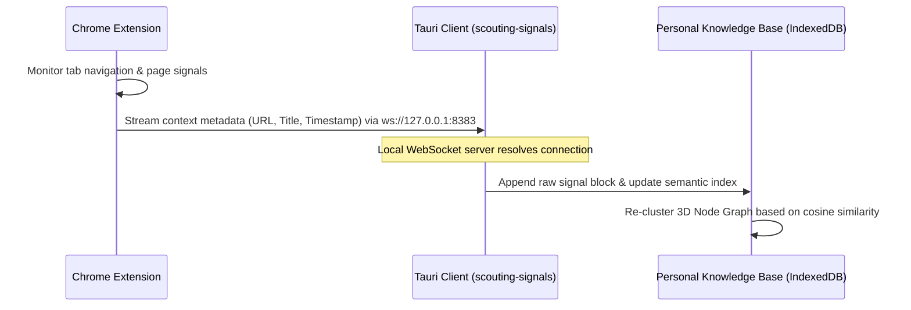

# 🧠 The Motivation: Bridging Active Thoughts and Passive Signals

Have you ever tried to recall a developer article you read last Tuesday to debug an obscure compiler warning, only to spend twenty minutes digging through your cluttered browser history?

We have all been there. Traditional Personal Knowledge Management (PKM) systems expect us to be meticulous archivists. They demand that we manually capture every key thought, summarize every article, format links, and build connections. But during active engineering and research workflows, this manual overhead introduces friction. We choose flow over curation. The result? A massive gap between what we actually interact with and what we end up saving in our personal wikis.

To solve this, I am building a local-first **Personal Knowledge Base** that acts as the storage, visual graph, and query interface for both active notes and automated, passive digital signals.

---

## ⚖️ Active vs. Passive Knowledge

A complete cognitive map requires two distinct inputs:

| Aspect | Active Curation (Personal Wiki) | Passive Signals (Signal Scout) |
| :--- | :--- | :--- |
| **Origin** | Hand-written write-ups, architecture specs, structured logs. | Visited pages, active documentation tabs, developer console logs. |
| **Volume** | Low volume, highly refined. | High volume, raw contextual data. |
| **Effort** | High friction (requires manual writing and formatting). | Zero friction (collected automatically in the background). |
| **Role** | Represents what you *decided* is important. | Represents what you *actually* interacted with to get there. |

By building a system that ingestion-bridges both streams, we can reconstruct the exact context of any past decision, research spike, or debugging session without manual logging.

---

## 📡 Enter Signal Scout: The Context Collector

To feed the passive signal stream into our knowledge base, I have been engineering a companion project called **Signal Scout**. 

Signal Scout consists of two decoupled components:
1. **The Chrome Extension**: A lightweight Manifest V3 background worker that monitors active developer tabs, reading metadata like URL targets and page titles.
2. **The Desktop Client**: A macOS application built on Tauri (`scouting-signals`) that exposes a high-performance local WebSockets server.

Instead of writing scripts to parse history databases, the extension streams active browsing signals in real-time to the desktop client:

This bridge captures the trail of breadcrumbs we leave behind when solving hard technical problems.

---

## 🔒 The Hard Requirement: Absolute Privacy & Performance

Automatically capturing browser history, active URLs, and development signals introduces a significant security surface. Sending this high-fidelity stream of private thoughts to an external cloud database or a third-party LLM API is a non-starter. 

This is why the Personal Knowledge Base and Signal Scout are designed under a strict **local-first, loopback architecture**:

* **Zero Cloud Footprint**: Communication between the browser extension and the Tauri client occurs exclusively over the local loopback address (`127.0.0.1`) on port `8383`. No packets ever leave your machine.
* **On-Device Embedding Generation**: To support semantic search and contextual graph grouping, the system loads local ONNX-runtime sentence embedding models (via Transformers.js) directly inside browser Web Workers, utilizing WebGPU acceleration.
* **Instant Offline Retrieval**: Because the data is stored in a local B-Tree IndexedDB adapter, search queries are executed in under `10ms`, even when working completely offline in a cafe or on a flight.

---

## 💡 The Ultimate Vision

By merging active note-taking with automated context scouting, your knowledge base becomes an extension of your memory. 

Imagine typing `hashing algorithms` and instantly seeing not just the wiki pages you manually wrote, but a visual cluster of the actual GitHub repositories you starred, the stack overflow answers you spent more than three minutes reading, and the local file paths of the scripts you ran—all linked together in a unified 3D graph.

We are building the infrastructure to make this possible, one local signal at a time. 🚀
