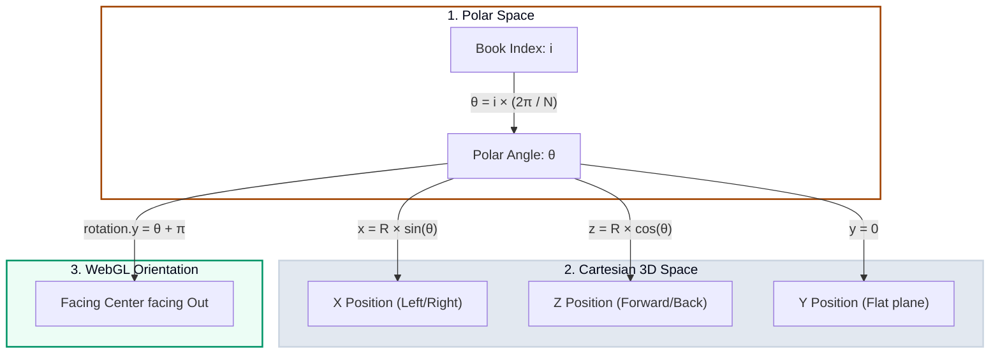
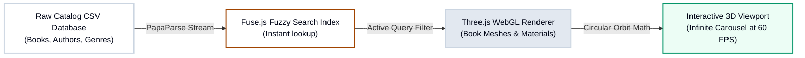

# 📚 Engineering a 3D WebGL Book Shelf & Infinite Carousel

Have you ever wanted to walk through your digital library catalog as if it were a physical room?

Traditional digital libraries are flat grids—simple thumbnails on a screen. While functional, they lose the tactile, serendipitous feeling of browsing a physical bookshelf or spinning a circular book rack.

To bring that immersive feeling to the browser, I built **The Book Shelf**, an interactive, serverless 3D digital catalog of my active reading shelf. The application renders hundreds of books in an immersive WebGL-powered 3D canvas, featuring a custom circular carousel orbit, clean database parsing, and instant fuzzy searching.

---

## 🎨 Dual Viewports: Spatial & Structured Reading

To support different browsing modes, the application implements a dual-viewport controller:

1. **Immersive Infinite Carousel**: A 3D circular layout displaying books in a floating, rotatable ring. As you click or drag, the rack spins with organic inertia, casting real-time shadows onto a clinical lab-notebook blueprint flooring.
2. **Traditional Bookcase (Library View)**: A 3D grid layout arranging books on multiple horizontal wooden shelves, simulating a physical cabinet library.

---

## 📐 Trigonometric Math of the 3D Carousel Orbit

To arrange $N$ books evenly along a perfect 3D circular ring on the WebGL canvas, the engine translates polar coordinates (angles) into Cartesian 3D coordinates $(x, y, z)$ in the WebGL space:

### 1. Position Coordinates
For any given book index $i$ in a list of $N$ total books, the angular offset $\theta_i$ along the circle is calculated as:

$$\theta_i = i \cdot \frac{2\pi}{N}$$

Given a target orbit radius $R$, the 3D position vector $\vec{P}_i = (x_i, y_i, z_i)$ of the book is computed using standard trigonometric projections:

$$x_i = R \cdot \sin(\theta_i)$$
$$y_i = 0$$
$$z_i = R \cdot \cos(\theta_i)$$

### 2. Angular Alignment (Billboard facing)
To ensure the spine or cover of every book faces outward from the center of the ring toward the camera, we set the Y-axis rotation of each 3D object to face its respective angular coordinate:

$$\text{rotation}_y = \theta_i + \pi$$

---

## ⚡ Technical Architecture: Blistering 60 FPS in WebGL

The application is completely static, loading database trees dynamically and executing client-side calculations:

* **Three.js & WebGL (`three.js`)**: Leverages optimized box geometry meshes mapped with custom cover texture maps, floating lights, and orthographic grid shadows.
* **Fuzzy Database Indexing (`fuse.js`)**: Implements client-side approximate string-matching (Levenshtein Distance) on title, author, and category fields, allowing instantaneous typeahead searching over hundreds of items.
* **Decoupled CSV Parsing (`papaparse`)**: To prevent rigid database connections or database overheads, the application parses standard flat CSV data pools dynamically on initial mounting, caching the indices in system memory.
* **Vite Bundler (`vite`)**: Leverages dynamic imports and production code splitting to tree-shake heavy 3D math libraries, compiling the entire bundle in under 1 second.

---

## 🍳 Go Explore the Library

The catalog is fully synced to our automated deployment pipeline, rebuilding Vite assets recursively during `make build` and deploying directly to CDN edge nodes.

Explore the active bookshelf directly below, spin the circular rack, or open the catalog in a dedicated fullscreen viewport:

👉 **[Launch Book Shelf in new tab](https://vikramtiwari.com/books)**

*What books are on your active shelf? Search for a title, slide the rack, and enjoy the spatial reading gallery!* 📚
