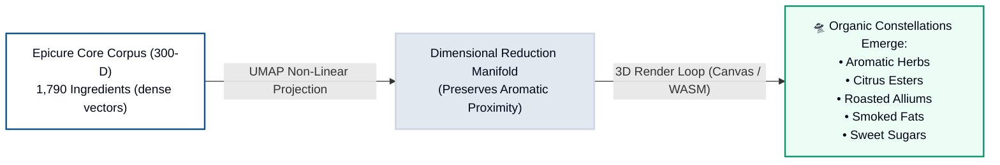
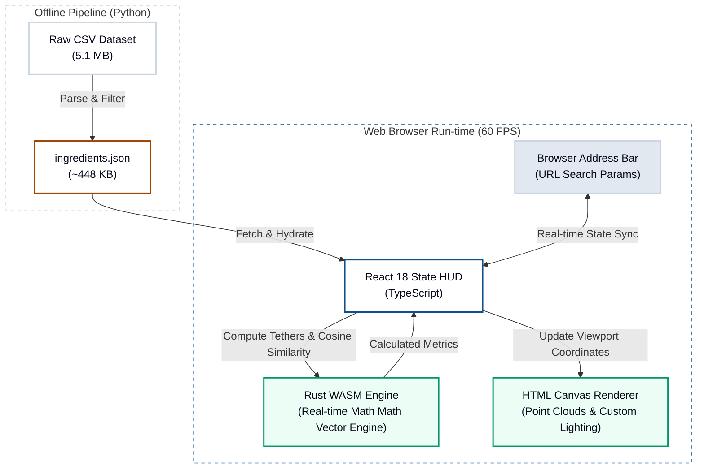

# 🚀 Journey into the 300-Dimensional Culinary Universe

Have you ever stared at a carrot and wondered, *"Is this closer to a parsnip or a coriander seed?"* 

If you ask a classical French chef, they’ll tell you about terroir, aromatics, and classical pairings. But if you ask a data scientist, they’ll look at you with a straight face and say: 

> **"In a 300-dimensional culinary universe, flavor is not an opinion—it is a coordinates system."**

Welcome to **The Flavor Explorer (The Culinary Universe)**, a side project born from the desire to take gastronomy, blend it with advanced machine learning, and visualize the cosmos of taste in real time. It is a fully interactive, serverless space mapping **1,790 ingredients** across a dense flavor manifold, built to discover perfect pairings, blend taste notes, and model recipe synergies.

---

## 🧬 The Scientific Ignition: arXiv:2605.22391

Traditional culinary pairing models are brittle. They usually rely on simple "shared compound" matching—the theory that if two foods share major volatile aromatic compounds (like white chocolate and caviar), they will taste great together. While this works occasionally, it misses the complex, multi-faceted nature of how we perceive taste.

To solve this, my visualizer is built upon dense scientific embeddings documented in the recent breakthrough paper:
📄 **[Read the Scientific Foundation: arXiv:2605.22391](https://arxiv.org/pdf/2605.22391)**

We start with the **Epicure Core Dataset**, containing **1,790 unique ingredients**. Instead of tracking individual flavor components manually, we represent each ingredient as a coordinate vector in a **300-dimensional space**. In this space, proximity is a direct proxy for flavor compatibility.

---

## 🌌 Squishing a 300-D Galaxy: The UMAP Lens

A 300-dimensional space is great for calculations, but terrible for human brains. If I asked you to walk 5 units along the "Smoky" axis and 3 units along the "Citrus Ester" axis in 300-D, you’d probably get lost.

To map this dense multidimensional cosmos onto a 3D web canvas, the engine uses **UMAP (Uniform Manifold Approximation and Projection)** with a cosine metric. 

Because UMAP preserves local relationships, beautiful, organic flavor constellations naturally emerge. You can zoom **20.0x** through a warm-parchment aesthetic galaxy, drifting from **Citrus Esters** (lemons, limes, lemongrass) over to **Smoked Fats** (smoked Gouda, bacon) and watch the dynamic tethers link them.

---

## 🔬 The Taste Lab Projection System

Macro-clustering is beautiful, but what if you are a chef looking to engineer a specific sensory profile? What if you want to balance your dish along a custom axis?

In the **Taste Lab**, we allow you to project the 300-dimensional ingredient vectors onto **ten direct taste anchors**:

| Taste Anchor | Ingredient Representing the Vector Axis |
| :--- | :--- |
| **Sweet** | Brown Sugar (`brown_sugar`) |
| **Sour** | Apple Cider Vinegar (`apple_cider_vinegar`) |
| **Salty** | Bamboo Salt (`bamboo_salt`) |
| **Bitter** | Cocoa Butter (`cocoa_butter`) |
| **Umami** | MSG (`msg`) |
| **Spicy** | Chili Pepper (`chili_pepper`) |
| **Herbal** | Basil (`basil`) |
| **Citrusy** | Lemon (`lemon`) |
| **Smoky** | Bacon (`bacon`) |
| **FattyRich** | Almond Butter (`almond_butter`) |

### 📐 Turning Linear Math into Sensory Drama

When you select custom axes to project your ingredient vectors, the engine projects the 300-D ingredient vector $\vec{v}_i$ onto the normalized target anchor vector $\vec{a}_t$ using the vector **dot product**:

$$\text{Sensory Projection Score} = \vec{v}_i \cdot \vec{a}_t$$

To make this feel like a premium, dynamic sensory experience, we apply a contrast adjustment. The raw dot products are min-max normalized across the entire dataset and then scaled exponentially:

$$\text{Adjusted Score} = S^{1.6}$$

This **$S^{1.6}$ exponential contrast multiplier** suppresses noise in weak flavors and highlights prominent sensory contrasts—making the visual peaks feel highly dramatic and responsive!

---

## ⚡ Under the Hood: Rust WASM & Canvas wizardry

Rendering 1,790 nodes, calculating real-time distance tethers, applying lighting, and projecting vectors at 60 FPS in a web browser is incredibly demanding. 

To achieve blistering performance, the project uses a highly optimized hybrid architecture:

* **React 18 & TypeScript**: Handles state synchronization and UI HUD layout.
* **Pure HTML Canvas Renderer**: Renders point clouds, lighting, point offsets, and cosmic dust.
* **Rust WebAssembly Engine (`wasm-engine/`)**: Handles heavy mathematical operations, including real-time cosine similarity matrix lookups and distance tether calculations, compiled to binary WASM.
* **Offline Asset Pipeline**: To keep the app fast and lightweight for static hosting, the 5.1 MB raw CSV dataset is parsed offline using Python. Only a pre-compiled, highly optimized `ingredients.json` (~448 KB) metadata tree is loaded by the browser.

---

## 🔗 Deep-Linking the Cosmos: Share Your Flavor State

One of the coolest features under the hood is **URL State Synchronization**. 

Every single camera rotation, zoom multiplier, active grid axis, connector tether, and selected ingredient node index is synchronized in real time with the browser search parameters. Sharing a URL restores the exact perspective, focus, and tethers immediately:

`https://culinary-universe.vikramtiwari.com/?x=herbal&y=sweet&zoom=14.5&focus=mint_leaves`

This means you can discover a wild pairing connection, click copy, and send it to another chef to show them the exact orbital alignment.

---

## 🍳 Go Explore the Universe

The code is fully open-source, and all operations are wrapped in an easy-to-use developer `Makefile` (running data-generation via UMAP, compiling WASM, and launching the Vite dev server).

Explore the interactive graph directly below, or open it in a new window:

👉 **[Launch The Flavor Explorer in new tab](https://culinary-universe.vikramtiwari.com/)**

*What's your favorite unexpected ingredient pairing? Select it, copy your URL parameters, and send them my way!* 🍳
