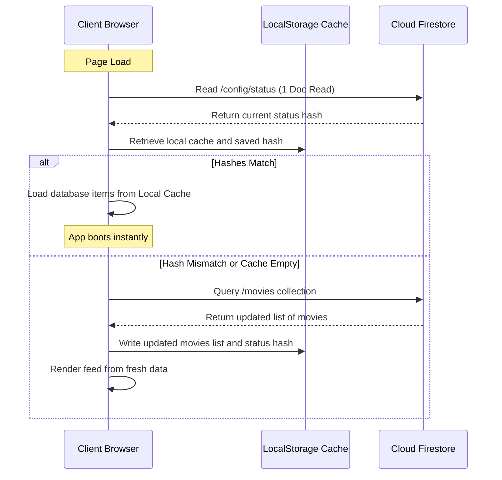

# 📺 MeTube: Building a Premium, Distraction-Free Curated Video Gallery

With the modern web increasingly dominated by autoplay, recommendation algorithms, and intrusive ads, creating a dedicated, clean portal for personal video curation is a rewarding engineering exercise. 

**MeTube** is a premium, distraction-free movie and video curating gallery. It serves as a personal cinema room where users can browse, search, and watch curated videos directly inline without external distractions.

* **Live App**: [metube.vikramtiwari.com](https://metube.vikramtiwari.com)
* **Tech Stack**: Vanilla ES6 JavaScript, CSS3 Cascade Layers, Cloud Firestore, Firebase Hosting, Vite, Lucide SVGs

---

## 🏗️ Core Architecture & Firestore Caching Strategy

To keep database read costs to an absolute minimum and ensure instant load times, MeTube implements an **optimistic caching system** on top of Cloud Firestore.



By querying the `/config/status` document first, the application determines if any movies have been added or updated since the last visit. If the hash is identical to the one stored in the browser's `localStorage`, the app loads the entire gallery collection from local storage. This reduces typical database queries from *N* document reads down to exactly **one document read** per page load.

---

## 🔒 Local Development Seeder Middleware

One of the cleanest architectural details of MeTube is how it handles data ingestion. In production, the Cloud Firestore security rules are configured to be **100% read-only** for all clients. This prevents malicious writes, database spamming, and potential billing abuse.

To allow movie seeding without exposing administrative write capabilities in the frontend build, MeTube implements a dev-only seeder portal:

1. **Local Vite Middleware**: When a developer submits a YouTube URL or ID, the client sends a `POST` request to a local `/api/add-movie` endpoint configured via a custom Vite plugin in `vite.config.js`.
2. **Local GCP Credentials**: The local Node dev server calls the Google Cloud CLI (`gcloud auth print-access-token`) in the background to obtain a temporary access token.
3. **Automated Ingestion**: The middleware uses this access token to securely write the new movie metadata to Firestore, queries the YouTube oEmbed API to fetch the official video title, and updates the global cache status hash in `/config/status`.

---

## 🎨 Premium CSS Foundations

The layout is built entirely with CSS3 Cascade Layers (`@layer`) and Custom CSS variables to maintain a premium feel. Highlights include:

* **HSL-Tailored Color Schema**: Rather than using generic hex codes, colors are derived dynamically using relative HSL variables to maintain contrast and support dark/light mode transitions smoothly.
* **Glassmorphism**: Header and filter bars leverage modern backdrop filters:
  ```css
  background: var(--header-bg-opaque);
  backdrop-filter: blur(12px);
  border-bottom: 1px solid var(--border-light);
  ```
* **Autocomplete suggestions**: A fully keyboard-navigable search suggestions popup is coded with raw JavaScript event listeners tracking `ArrowUp`, `ArrowDown`, `Enter` to commit, and `Escape` to close.

---

## 🕹️ Interactive Features & Local-First Personalization

### 1. "Surprise Me" Roll & Fullscreen Player
The primary action button, "Surprise Me", triggers a Fisher-Yates shuffle sequence on the currently filtered subset of videos, selects one at random, and boots the immersive fullscreen overlay player. 

To create a theater-like atmosphere, the player overlay calls the browser's native OS-level Fullscreen API (`element.requestFullscreen()`). When the user exits the player or hits `Escape`, it closes the overlay, terminates the YouTube iframe audio, and exits fullscreen mode seamlessly.

### 2. Local-First Watched History & Favorites
Watch metrics are computed entirely on the client-side to preserve user privacy and avoid server writes. 

* **LocalStorage Tracking**: View counts are tracked under the key `metube_personal_views`.
* **Badge Upgrades**: 
  * If a video's watch count is `1`, it is overlayed with a green `Watched` checkmark badge.
  * If the watch count is `2` or more, the badge automatically upgrades to a pink `Watched [N]x` heart badge, flagging the video as a personal favorite.
* **Sorting by Favorites**: Users can sort the feed by "Favorites", which computes the local watch counts on the fly and displays the user's most frequently watched videos at the top.

---

## 🔗 Portable Playlists & Hidden Easter Eggs

To share selections without storing user-generated playlists on the server, MeTube features a portable playlist generator at the `/builder` route:

* **Concatenated Hashes**: When a user selects a queue of movies in the builder, the app compiles their 11-character YouTube video IDs into a single URL hash (e.g., `/i/#id1,id2,id3`).
* **Instant Reconstitution**: When a visitor opens a shared link, the client reads the URL fragment, splits the IDs, and renders the feed exclusively with those videos.

### The Theme-Toggle Easter Egg
To keep the main interface pristine and distraction-free, the link to the playlist builder page is hidden behind a playful developer Easter egg:

> [!TIP]
> **How to find the builder**: Rapidly toggle the Light/Dark mode theme button **10 times within 5 seconds**. A hidden "Create Playlist" button will slide out in the sidebar, providing direct access to the builder.
