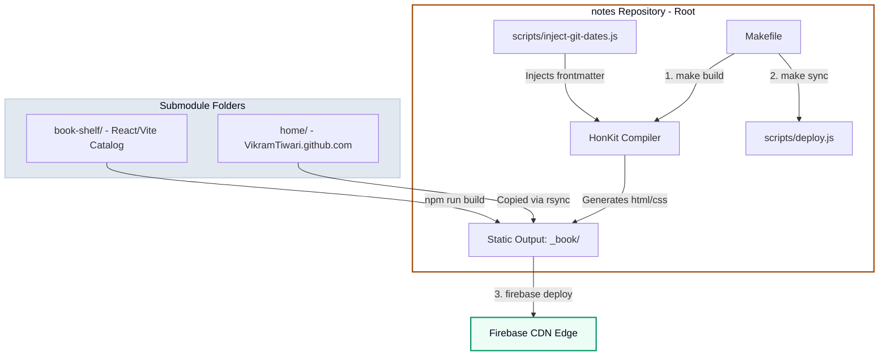

# 📐 Notes Architecture & Build Engineering

This website, [notes.vikramtiwari.com](https://notes.vikramtiwari.com), is more than a simple static site; it is a highly custom, technically optimized, and accessible **"Clinical Logbook"** and knowledge base. 

To achieve maximum performance, responsive readability, and a seamless authoring workflow, the site leverages HonKit compiling, native client-side search indexing, modular styles, Git submodules, and automated history auditing.

---

## 🏛️ System Topology

Here is the architectural layout showing how independent repositories, Vite applications, and static build compilation flows merge into a single, unified static folder structure deployed on Firebase Hosting:



---

## 🎨 Aesthetic Theme: The Clinical Logbook

The website uses a custom, harmonic theme blending three complementary designs:
1. **Archival Cotton Paper Backdrop**: A light, low-glare Cotton base (`#f5f4ef`) decorated with a crisp, sky-blue **engineering blueprint graphing grid** lines spaced exactly `25px` apart.
2. **Clinical Slate Control Sidebar**: A distinct slate console (`#e2e8f0`) framing the main viewport, providing a locked console look.
3. **High-Contrast Terminal Panels**: Monospaced code blocks are rendered inside deep midnight-black CRT console boxes (`#060913`) utilizing bright radioactive neon-green (`#00ff87`) and sky-blue keywords for clinical code log aesthetics.

---

## 📂 Modular Stylesheet Architecture

To speed up styling iteration and follow modern design patterns, we refactored a monolithic 600-line CSS sheet into four highly decoupled, specialized stylesheets under the `styles/` folder, integrated cleanly using native relative `@import` rules:

```css
/* website.css - Styling import hub */
@import url('variables.css');
@import url('layout.css');
@import url('typography.css');
@import url('widgets.css');
```

| Stylesheet | Core Responsibility | Key Components |
| :--- | :--- | :--- |
| **`variables.css`** | Global design system tokens | Color palettes (HSL scales), Google Fonts (Space Grotesk, Fira Code), body graph grid backgrounds. |
| **`layout.css`** | Layout wrappers and dimensions | Sidebar console constraints, absolute header positions, widescreen limits (`1400px`), search HUD positioning. |
| **`typography.css`** | Text hierarchy and semantics | Heading rules, bullet list indentation cascading, observation quote frames, table calibration borders. |
| **`widgets.css`** | High-performance interactive blocks | CRT terminal code boxes, code-copy HUD triggers, glowing custom scrollbars, Prism highlight tokens, Mermaid canvas cards. |

---

## 🧭 Viewport Locking & Scroll Persistence

### 1. Locked Sidebar Flexbox
Traditional sidebar scrolling resets or shifts when the page expands. To solve this:
* We structured `.book-summary` as a vertical Flexbox container (`display: flex; flex-direction: column; overflow: hidden;`).
* Pinned the custom brand header ("Vik's Notes") and the search input container using `flex-shrink: 0`, making them perfectly static.
* Configured only the navigation list (`nav`) below the search box to scroll vertically (`flex-grow: 1; overflow-y: auto;`), styled with a thin custom slate scrollbar.

### 2. Scroll Restoring Across PJAX Transitions
HonKit utilizes **PJAX (pushState AJAX)** for dynamic page transitions, swapping the sidebar HTML elements and resetting scrollbars. To persist the scroll coordinate:
* We listen to scroll events on `.book-summary nav` with a `50ms` debounce, saving the current `scrollTop` offset into `sessionStorage`.
* During page change event transitions (`gitbook.events.bind("page.change")`), our controller reads the saved offset and immediately restores it.
* A fallback is run inside a `requestAnimationFrame` block on the next viewport loop to ensure the browser has fully calculated dynamic heights, avoiding layout snapping.

---

## 🔍 Header Spotlight Search HUD

Instead of loading search results on a separate page, we created a Google Spotlight-style centered search bar overlay inside the header:

```javascript
// Click interceptor that opens search HUD
headerTitleLink.addEventListener("click", function(e) {
  e.preventDefault(); // Blocks default home page redirect
  
  headerH1.style.setProperty("display", "none", "important"); // Hides center title only
  headerSearch.style.setProperty("display", "flex", "important"); // Reveals search box
  headerSearchInput.focus(); // Focuses input
});
```

* **Dashed Underline Styling**: Constrained to a focused `380px` area in the absolute center, featuring a `2px dashed cobalt-blue` bottom border resembling a command prompt.
* **Metadata Preservation**: Hiding the title leaves the published and last-updated dynamic dates visible at the outer edges of the header on desktop. Media queries gracefully hide the metadata on screens `< 768px` to prevent overlap.
* **HTML5 Native Syncing**: Typing in the centered input dynamically syncs and dispatches native browser events (`input`, `change`, `keyup`) to the hidden sidebar input field. HonKit's underlying Lunr search indexer is triggered automatically, showing results in the main page wrapper.
* **Dismiss states**: Clicking the close button (`×`), tab-blurring while empty (`blur`), or pressing `Escape` instantly resets queries, restores the central title, and reverts the header layout.

---

## ⚙️ Compilation & Automation Pipeline

The website relies on automated targets managed by a top-level **`Makefile`**:

### 1. Git-based Date Injection
To prevent hardcoding publication variables, the build pipeline runs `node scripts/inject-git-dates.js` automatically during build:
1. Scans all markdown pages in the workspace.
2. Queries local Git commit history to extract the absolute creation date (`git log --diff-filter=A --format=%aI`) for each page.
3. Automatically writes a `date` field in the frontmatter of pages missing it.
4. Reads the file modification metadata (`file.mtime`) to dynamically display last-updated values.
5. In the browser, these dates are displayed relative to the present moment (e.g. `yesterday`, `3 weeks ago`) and toggle to raw absolute timestamps on-click.

### 2. Multi-Repository Orchestration
Landing pages and specialized catalog apps are maintained in independent repositories. To integrate them without writing dynamic loaders:
* The landing page (`home/`) and bookshelf application (`book-shelf/`) are locked as official **Git submodules** inside the notes workspace.
* The Makefile automates their synchronization:
  ```makefile
  build:
      node scripts/inject-git-dates.js
      npx honkit build ./ _book/notes
      rsync -av --exclude='.git' home/ _book/
      cd book-shelf && npm install && npx vite build --base=/books/
      mkdir -p _book/books && cp -r book-shelf/dist/* _book/books/
      node scripts/generate-sitemap.js
  ```
* Running `make build` compiles the book, updates sitemaps, bundles the Vite catalog assets, and packages them into the clean static folder `_book` ready for 2-second hosting deploys!

### 3. Firebase Deployment & Client-Side Routing

Once compiled, the `_book` directory is deployed to Firebase Hosting via `make deploy` (which internally runs `node scripts/deploy.js`). Firebase Hosting is configured in `firebase.json` to serve the unified layout:

```json
{
  "hosting": {
    "public": "_book",
    "ignore": [
      "firebase.json",
      "**/.*",
      "**/node_modules/**"
    ],
    "rewrites": [
      {
        "source": "/books/**",
        "destination": "/books/index.html"
      }
    ]
  }
}
```

* **SPA Rewriting**: The rewrite rule redirects all traffic under `/books/**` to `/books/index.html`. This ensures that Three.js routes and dynamic sub-pages in the React/Vite book catalog render seamlessly without browser-level 404 page-load errors.
* **Global CDN Edge Caching**: By utilizing Firebase's global CDN, static resources are cached close to visitors, reducing Time to First Byte (TTFB) to milliseconds.

---

## 🏁 Summary of Benefits

This modular, static-first architecture delivers powerful engineering advantages:
1. **0ms Cold Starts**: By serving pre-compiled HTML and client-side Lunr/JS search indices directly from CDN edges, the site requires no running backend processes, databases, or API queries.
2. **Accessible Speed**: LCP (Largest Contentful Paint) is highly optimized through decoupled styles, compressed system typography (Space Grotesk), and the omission of bulky client-side frameworks for text notes.
3. **Decoupled Workflows**: Since the landing page (`home/`) and the interactive bookshelf catalog (`book-shelf/`) exist as separate Git submodules, updates can be authored, built, and tested independently before publishing.
