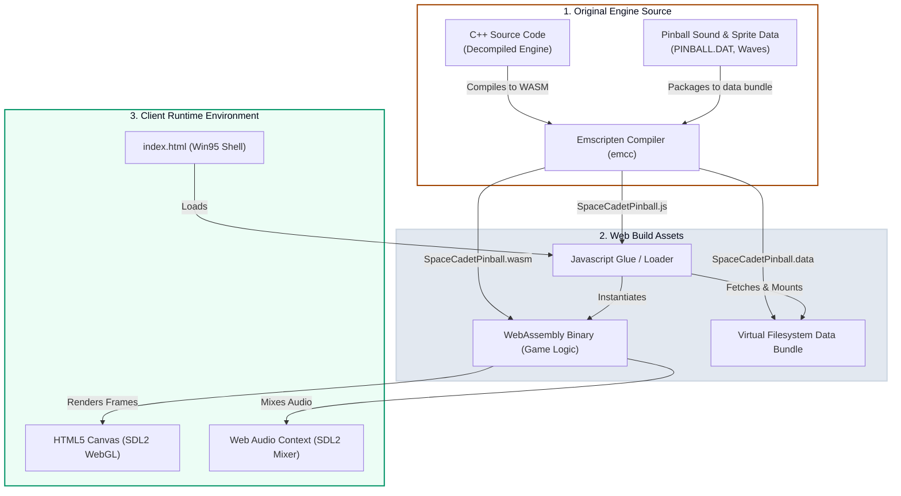

# 🕹️ Porting Windows 3D Pinball: Space Cadet to the Web

Remember the clicks, whirs, and classic chiptune sounds of the pre-installed pinball game on Windows 95/XP? 

*3D Pinball for Windows – Space Cadet* was a staple of early desktop gaming. As part of preserving and modernizing classic software, this project hosts a fully functional, web-native port of the game at [pinball.vikramtiwari.com](https://pinball.vikramtiwari.com). The engine compiles a decompiled C++ representation of the original game into WebAssembly (WASM), maps its memory buffers to the browser via SDL2, and packages the experience inside a nostalgic Windows 95 user interface.

---

## 🏗️ Compilation & Asset Pipeline

To run native C++ game loops directly inside a standard browser sandbox without plugins, the build pipeline leverages **Emscripten** to bridge system calls to Web APIs:



---

## ⚡ Technical Architecture

### 1. Cross-Compilation via Emscripten
The original game engine relies on low-level Win32 APIs for rendering, window handling, and sound synthesis. By targetting a decompiled cross-platform C++ variant (specifically `k4zmu2a/SpaceCadetPinball`), we use Emscripten to replace Win32 system hooks with **SDL2 (Simple DirectMedia Layer)**:
* **Audio Layer**: Compiles the game's audio synthesizer to Web Audio API via SDL2 Mixer channels, preserving the exact MIDI-like chiptune effects and retro alerts.
* **Input Layer**: Translates browser keyboard keycodes (such as spacebar for launching the ball, and `z` / `/` keys for flippers) into standard SDL input events.

### 2. Nostalgic Windows 95 Styling
To complete the retro experience, the WebAssembly canvas is wrapped inside a custom Windows 95/XP style window component. The styling leverages a clean CSS variables system mirroring the classic Windows color scheme:

```css
:root {
    --ActiveBorder: rgb(212, 208, 200);
    --ActiveTitle: rgb(10, 36, 106);
    --Background: rgb(58, 110, 165); /* Windows Teal Desktop Color */
    --ButtonFace: rgb(212, 208, 200);
    --ButtonHilight: rgb(255, 255, 255);
    --ButtonShadow: rgb(128, 128, 128);
}
```

By applying precise double-border offsets (combining `box-shadow` inset rules and borders), the wrapper recreates the distinct 3D bevel looks of classic Win32 applications:
* **Inner Box Shadow Bevels**:
  ```css
  box-shadow: -0.5px -0.5px 0px 0.5px var(--ButtonHilight), 
              0px 0px 0px 1px var(--ButtonShadow), 
              -0.5px -0.5px 0px 1.5px var(--ButtonLight), 
              0px 0px 0px 2px var(--ButtonDkShadow);
  ```
* **Titlebar Controller**: Features the traditional blue-to-light-blue gradient backdrop, title font, icon placement, and the minimization, maximization, and close window vectors.

---

## 🚀 Play the Game

The project is hosted completely static, loading dependencies on-demand to achieve sub-second startup times.

Click below to open the game in a new browser tab and start racking up high scores:

👉 **[Launch 3D Pinball in new tab](https://pinball.vikramtiwari.com)**

<div class="demo-embed-container" data-src="https://pinball.vikramtiwari.com" data-label="LAUNCH 3D SPACE CADET PINBALL"></div>

*Controls: Spacebar (Hold/Release to Launch Ball), Z (Left Flipper), / (Right Flipper).* 🕹️
